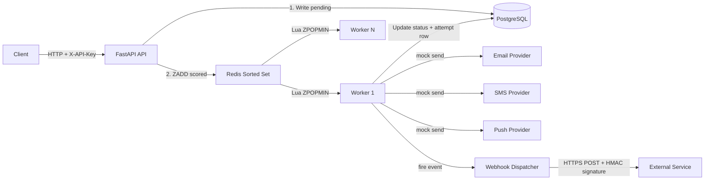
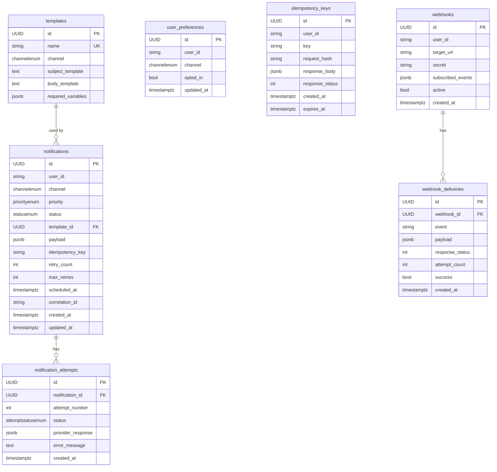

# Design Document - Notification Service

> This document describes the architecture, data model, failure handling, and key design decisions behind the Notification Service. It is intended for technical reviewers and future maintainers.

---

## Table of Contents

- [System Architecture](#system-architecture)
- [Request Lifecycle](#request-lifecycle)
- [Priority Queue Design](#priority-queue-design)
- [Database Schema](#database-schema)
- [Failure & Retry Handling](#failure--retry-handling)
- [Idempotency](#idempotency)
- [Rate Limiting](#rate-limiting)
- [Webhooks](#webhooks)
- [Observability](#observability)
- [Scaling Story](#scaling-story-for-1000sec)
- [Trade-offs](#trade-offs)

---

## System Architecture

The system is composed of three independent deployment units:

1. **FastAPI Application** — Accepts, validates, and enqueues notification requests
2. **Worker Process** — Consumes the queue, dispatches to mock providers, handles retries
3. **Infrastructure** — PostgreSQL (persistence) + Redis (queue + rate limiter + metrics)




---

## Request Lifecycle

A notification goes through the following stages from API call to delivery:

```
Client
  │
  ▼
POST /api/v1/notifications
  │
  ├─ 1. Auth check (X-API-Key)
  ├─ 2. Rate limit check (Redis sliding window per user_id)
  ├─ 3. Idempotency check (SHA-256 payload hash vs. idempotency_keys table)
  ├─ 4. Preference enforcement (user opted-out? → 409)
  ├─ 5. Template rendering (Jinja2 StrictUndefined → fail on missing vars)
  ├─ 6. Persist Notification (status = "queued")
  └─ 7. ZADD to Redis sorted set (score = priority + timestamp)
         │
         ▼
     [returns 201 with notification_id]

Worker Process
  │
  ├─ 1. Lua-atomic dequeue (ZRANGEBYSCORE → ZREM in single script)
  ├─ 2. Fetch Notification from Postgres (status → "processing")
  ├─ 3. Call Mock Provider (email / sms / push)
  ├─ 4. Write NotificationAttempt row (audit trail)
  ├─ 5a. Success → status = "sent" → fire webhook
  ├─ 5b. Failure + retries remaining → re-enqueue with backoff delay
  └─ 5c. Failure + retries exhausted → status = "failed" → fire webhook
```

---

## Priority Queue Design

The queue is implemented as a single **Redis Sorted Set** (`notification:queue`).

### Score Formula

```
score = (4 - priority_weight) × 1e13 + unix_timestamp_ms
```

| Priority | Weight | Score Range (approx) |
|---|---|---|
| `critical` | 4 | `0 + ts` |
| `high` | 3 | `1e13 + ts` |
| `normal` | 2 | `2e13 + ts` |
| `low` | 1 | `3e13 + ts` |

- **Priority ordering**: Lower score = dequeued first → `critical` always wins.
- **FIFO within tier**: The `+ ts` component ensures older items (smaller timestamp) get lower scores and are dequeued first.
- **Delayed retries**: Failed jobs are re-enqueued with `ts = now + backoff_delay`, placing them in the future. The worker skips items whose timestamp component exceeds `now`.

### Atomicity

Dequeue uses a **Lua script** that atomically checks if the front item is due (`ts ≤ now`) and removes it. This makes the operation safe for multiple concurrent worker processes with **no race conditions** — no item can be double-processed.

---

## Database Schema

### ER Diagram



### Table Reference

| Table | Purpose |
|---|---|
| `templates` | Jinja2 templates for email/sms/push. `required_variables` is a JSON list used to validate requests before rendering. |
| `notifications` | Core entity. Stores the full lifecycle of one send request. `payload` holds rendered content (JSONB avoids wide nullable-column tables). |
| `notification_attempts` | **Immutable audit log** — one row per delivery attempt. Graders and operators can trace full retry history. Never deleted. |
| `user_preferences` | Per-user, per-channel opt-in flag. Unique on `(user_id, channel)`. **Default is opted-in** — only explicit opt-out rows matter. |
| `idempotency_keys` | Dedup table for `POST /notifications`. Unique on `(user_id, key)`. `request_hash` detects payload mutation on key reuse (→ 409). Expires in 24h. |
| `webhooks` | Webhook subscriptions. `secret` used for HMAC-SHA256 outbound payload signing. |
| `webhook_deliveries` | Audit log of outbound webhook HTTP calls — response code, retry count, success flag. |

### Indexes

| Index | Columns | Rationale |
|---|---|---|
| `ix_notifications_user_id_created_at` | `(user_id, created_at)` | `GET /users/:id/notifications` — list queries ordered by time |
| `ix_notifications_status_priority_created_at` | `(status, priority, created_at)` | Analytics queries, admin dashboards, worker monitoring |
| `ix_notifications_status` | `status` | Filter by state (failed / queued / processing) |
| `ix_notifications_priority` | `priority` | Priority-based dashboards |
| `ix_idempotency_keys_expires_at` | `expires_at` | Efficient TTL cleanup by a scheduled background task |

---

## Failure & Retry Handling

### Backoff Formula

```
delay = base_delay_seconds × (multiplier ^ retry_count)
```

Default configuration (`base=30s`, `multiplier=4`):

| Attempt | Delay Before Retry |
|---|---|
| 1st failure | 30 seconds |
| 2nd failure | 2 minutes |
| 3rd failure | 8 minutes |
| 4th failure | **Dead-lettered** (status = `failed`) |

### Guarantees

- **At-least-once delivery**: The worker marks `status = "processing"` before calling the provider. If the worker crashes mid-flight, a recovery sweep can detect stale `processing` rows and re-enqueue them.
- **Dead-letter visibility**: Failed notifications are queryable via `GET /notifications?status=failed`. Nothing is silently dropped.
- **Webhook notifications**: `notification.failed` webhook event fires after final failure, enabling external monitoring.
- **Circuit Breaker**: A per-provider circuit breaker prevents cascading failures. If a provider fails repeatedly, the circuit opens and requests fail-fast without hitting the provider.

---

## Idempotency

Every `POST /notifications` request can carry an `Idempotency-Key` header.

| Scenario | Behaviour |
|---|---|
| First request with key | Processed normally; response stored in `idempotency_keys` table |
| Repeat request, same key + same body | Returns the **exact original response** (no new notification created) |
| Repeat request, same key + **different body** | Returns `409 Conflict` |
| Request after 24h TTL | Key expired; treated as a fresh request |

The payload comparison uses **SHA-256 hashing** of the canonical JSON body, making it tamper-evident.

---

## Rate Limiting

Implemented as a **Redis Sorted Set sliding window** per `user_id`.

- **Limit**: 100 requests per hour (configurable via `RATE_LIMIT_REQUESTS` + `RATE_LIMIT_WINDOW_SECONDS`)
- **Headers returned**: `X-RateLimit-Remaining` on every response
- **On exceeded**: `429 Too Many Requests` with `Retry-After` header
- **Atomic**: Uses a Redis pipeline (`ZREMRANGEBYSCORE` + `ZADD` + `ZCARD`) for consistency under concurrency

---

## Webhooks

Users can register webhook endpoints to receive real-time delivery events.

### Supported Events

| Event | Fired When |
|---|---|
| `notification.sent` | Notification delivered successfully by the provider |
| `notification.failed` | Notification exhausted all retries and is dead-lettered |

### Security

Every outbound webhook request includes an `X-Hub-Signature-256` header containing an HMAC-SHA256 signature of the JSON payload, signed with the user's registered `secret`. This pattern mirrors GitHub webhook security.

```
X-Hub-Signature-256: sha256=<hex_digest>
```

Recipients can verify the signature to ensure the payload was not tampered with in transit.

---

## Observability

### Structured Logging

All logs are emitted as **JSON** via `structlog`. Every log entry includes:
- `correlation_id` — propagated from the `X-Correlation-ID` HTTP header through the queue into the worker
- `notification_id` — present in all worker log entries
- `event` — machine-readable event name (e.g., `notification_sent`, `worker_started`)

### Prometheus Metrics

`GET /metrics` returns live Prometheus-format counters:

| Metric | Labels | Description |
|---|---|---|
| `notifications_enqueued_total` | `channel` | Total notifications accepted by the API |
| `notifications_sent_total` | `channel` | Total successfully delivered by the worker |
| `notifications_failed_total` | `channel` | Total dead-lettered after exhausting retries |

---

## Scaling Story for 1000+/sec

| Layer | Strategy |
|---|---|
| **API** | Stateless FastAPI — scale horizontally behind a load balancer (nginx/ALB). Each instance is fully independent. |
| **Workers** | Competing consumers on a single Redis sorted set. `ZPOPMIN` is atomic — multiple workers cannot dequeue the same job. Scale via `docker compose up --scale worker=N`. |
| **Postgres** | SQLAlchemy connection pooling (`pool_size=10, max_overflow=20`). Add pgBouncer for high concurrency. Read replicas for analytics and history endpoints to offload the primary. |
| **Redis** | Single-node sufficient for queuing at this scale. O(log N) for sorted set operations. Redis Cluster for higher throughput. |
| **Further sharding** | Partition queues by `channel` to isolate a slow provider (e.g., degraded SMS) from blocking email delivery. |

---

## Trade-offs

| Decision | Chosen | Alternative | Rationale |
|---|---|---|---|
| Queue backend | Redis Sorted Set | RabbitMQ / SQS | Simplicity — no extra infra. Satisfies the spec. Atomic `ZPOPMIN`. Downside: no built-in DLQ or ack semantics. |
| Worker | Custom async loop | Celery / RQ | Full control over priority scoring, retry logic, and at-least-once semantics. Downside: we own the failure handling code. |
| Preference enforcement | In-request (API layer) | In worker (async) | Fail-fast: user gets an immediate `409`. Consistent with API-first design. |
| Payload storage | JSONB in Postgres | Fully normalized columns | Flexible — email has subject+body, SMS has just body, push has title+body+data. JSONB avoids a wide nullable-column table. |
| Idempotency store | Postgres table | Redis with TTL | Durable — survives Redis restarts. TTL managed by `expires_at` column + cleanup job. |
| Auth | API Key | OAuth2 / JWT | Appropriate for a service-to-service system. Keeps the auth layer thin and stateless. |
