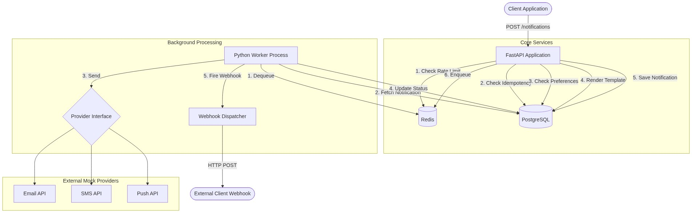

# Notification Service

> A production-grade, multi-channel notification delivery system built with **FastAPI**, **PostgreSQL**, and **Redis**. Designed for reliability, correctness, and observability at scale.



---

## Table of Contents

- [Overview](#overview)
- [Tech Stack](#tech-stack)
- [Features](#features)
- [Project Structure](#project-structure)
- [Getting Started](#getting-started)
- [API Reference](#api-reference)
- [Running Tests](#running-tests)
- [Design Assumptions](#design-assumptions)

---

## Overview

This service handles sending notifications across **Email**, **SMS**, and **Push** channels. It provides:

- A RESTful API for submitting and tracking notifications
- A Redis-backed **priority queue** (critical → high → normal → low) with strict FIFO ordering within each tier
- A background **worker** that processes the queue with retry/backoff and dead-letter handling
- Full **idempotency**, **rate limiting**, and **user preference** enforcement
- HMAC-signed **webhooks** that fire on delivery events
- Prometheus-format **metrics** and structured **JSON logging** with correlation IDs

---

## Tech Stack

| Concern | Technology | Rationale |
|---|---|---|
| Language / Framework | Python 3.11 + FastAPI | Async-native, auto OpenAPI docs, Pydantic v2 typing |
| Database | PostgreSQL + SQLAlchemy 2.0 (async) + Alembic | Relational model suits domain; asyncpg for high throughput |
| Queue | Redis Sorted Set | Atomic `ZPOPMIN`; priority + FIFO in a single data structure |
| Worker | Custom async event loop | Full control over dequeue, retry, dead-letter, and webhook dispatch |
| Templating | Jinja2 `StrictUndefined` | Hard-fail on missing template variables instead of silent blanks |
| Testing | pytest + pytest-asyncio + httpx | Fully async; all tests run without Postgres or Redis |
| Logging | structlog (JSON renderer) | Structured, grep-friendly, correlated across HTTP → worker |
| Containerization | Docker + Docker Compose | One-command full-stack startup |

---

## Features

### Core
- `POST /api/v1/notifications` — Create a notification (idempotent, rate-limited)
- `POST /api/v1/notifications/batch` — Submit a batch (207 Multi-Status, per-item results)
- `GET /api/v1/notifications/{id}` — Get notification status + full attempt history
- `GET /api/v1/users/{user_id}/notifications` — Paginated history with channel/status filters
- `POST /api/v1/users/{user_id}/preferences` — Opt a user in or out of a channel
- `GET /api/v1/users/{user_id}/preferences` — Retrieve all channel preferences

### Reliability
- **Priority Queue** — 4 tiers (critical / high / normal / low). Within a tier, FIFO is guaranteed via millisecond timestamp scoring.
- **Exponential Backoff Retries** — `delay = base × multiplier^n` (default: 30s, 2min, 8min)
- **Dead-letter Path** — After `MAX_RETRIES`, status is permanently set to `failed`. Nothing is silently dropped.
- **Circuit Breaker** — Prevents cascading failures to unresponsive providers.

### Developer Experience
- **Idempotency** — Send the same request twice with the same `Idempotency-Key` header and get the exact same response. Detects payload tampering with SHA-256 hashing.
- **Rate Limiting** — Sliding window (100 req/hr per `user_id`) backed by a Redis Sorted Set. Returns `X-RateLimit-Remaining` on every response.
- **Webhooks** — Register `target_url` + `secret` per user; receive HMAC-SHA256 signed `notification.sent` / `notification.failed` events.
- **Correlation IDs** — Every HTTP request gets an `X-Correlation-ID` that propagates through the queue into worker logs.
- **Prometheus Metrics** — `GET /metrics` returns live counters for enqueued, sent, and failed notifications per channel.

---

## Project Structure

```
notification-service/
├── app/
│   ├── api/v1/             # Route handlers (notifications, preferences, webhooks, analytics)
│   ├── core/               # Config, logging, exceptions, rate limiter, metrics, security
│   ├── db/                 # SQLAlchemy session, Alembic migrations
│   ├── models/             # ORM models (Notification, Attempt, Preference, Template, Webhook)
│   ├── providers/          # Mock Email, SMS, Push providers + Circuit Breaker
│   ├── queue/              # Redis Priority Queue (Lua-atomic dequeue)
│   ├── schemas/            # Pydantic request/response schemas
│   ├── services/           # Business logic (template, preference, idempotency, webhook)
│   ├── workers/            # notification_worker.py, retry_scheduler.py
│   └── main.py             # FastAPI app entrypoint
├── tests/
│   ├── integration/        # API endpoint tests (mocked DB + Redis)
│   └── unit/               # Pure unit tests for services and queue logic
├── Dockerfile              # Multi-stage build
├── docker-compose.yml      # Full stack: db, redis, migrate, api, worker
├── alembic.ini
├── pyproject.toml
└── requirements.txt
```

---

## Getting Started

### With Docker (Recommended)

```bash
cp .env.example .env
docker compose up --build -d
```

All services start automatically:
- API at **http://localhost:8000**
- Interactive docs at **http://localhost:8000/docs**

### Local Development (No Docker)

**Prerequisites:** Python 3.11+, PostgreSQL, Redis

```bash
# 1. Create and activate virtual environment
python -m venv venv
venv\Scripts\activate          # Windows
# source venv/bin/activate     # macOS / Linux

# 2. Install dependencies
pip install -r requirements.txt

# 3. Configure environment
cp .env.example .env           # Edit DATABASE_URL and REDIS_URL if needed

# 4. Run database migrations
alembic upgrade head

# 5. Start API (Terminal 1)
uvicorn app.main:app --reload

# 6. Start Worker (Terminal 2)
python -m app.workers.notification_worker
```

---

## API Reference

All endpoints (except `/health` and `/metrics`) require the `X-API-Key` header.

| Method | Endpoint | Description |
|---|---|---|
| `GET` | `/health` | Health check |
| `GET` | `/metrics` | Prometheus-format metrics |
| `POST` | `/api/v1/notifications` | Send a notification |
| `POST` | `/api/v1/notifications/batch` | Send a batch of notifications |
| `GET` | `/api/v1/notifications/{id}` | Get notification + attempt history |
| `GET` | `/api/v1/users/{id}/notifications` | List user notifications (paginated) |
| `POST` | `/api/v1/users/{id}/preferences` | Set channel preference |
| `GET` | `/api/v1/users/{id}/preferences` | Get channel preferences |
| `POST` | `/api/v1/webhooks` | Register a webhook |
| `GET` | `/api/v1/analytics/stats` | Notification delivery stats |

Full interactive documentation: **http://localhost:8000/docs**

**Example — Send a notification:**
```bash
curl -X POST http://localhost:8000/api/v1/notifications \
  -H "X-API-Key: super-secret-api-key" \
  -H "Idempotency-Key: order-123-notify" \
  -H "Content-Type: application/json" \
  -d '{
    "user_id": "user-abc",
    "channel": "email",
    "priority": "high",
    "message": "Your order {{order_id}} has shipped!",
    "template_variables": {"order_id": "ORD-9876"}
  }'
```

---

## Running Tests

All 21 tests run **without** Postgres or Redis — the test suite uses in-memory mocks.

```bash
pytest tests/ -v
```

Expected output: **21 passed**

---

## Design Assumptions

| Topic | Decision |
|---|---|
| **Auth** | Simple `X-API-Key` header. No OAuth/JWT — acceptable for this scope. |
| **Users** | Only `user_id` strings are stored. User records live in an external service. |
| **Default Preference** | Users are opted-in to all channels by default (no row = opted-in). |
| **Templates** | Stored in the `templates` DB table. Ad-hoc inline messages are also accepted. |
| **Idempotency TTL** | 24 hours from initial request. |
| **Rate Limit** | 100 requests per `user_id` per hour. Sliding window. |
| **Preference Enforcement** | Fail-fast in the API layer — returns `409 Conflict` immediately. |
| **Response Envelope** | All success responses use `{"data": ...}`. Errors use `{"error": {"code", "message"}}`. |
